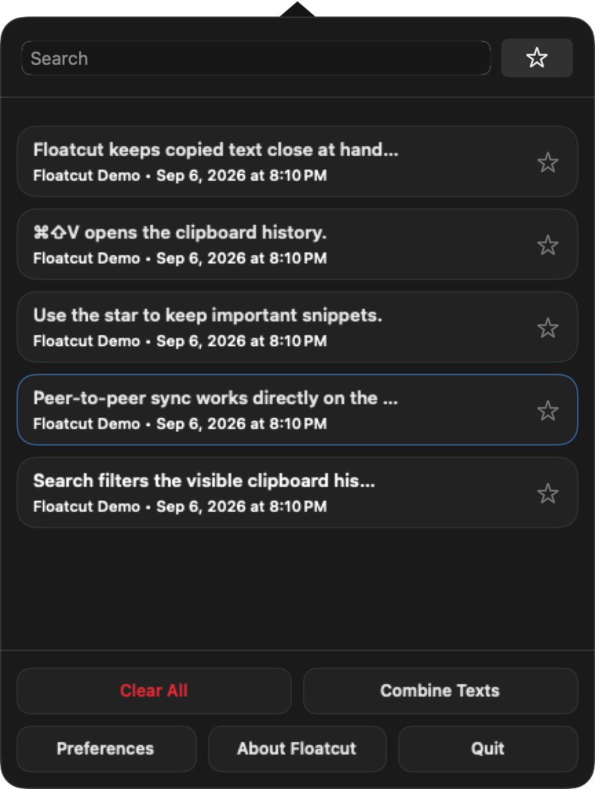
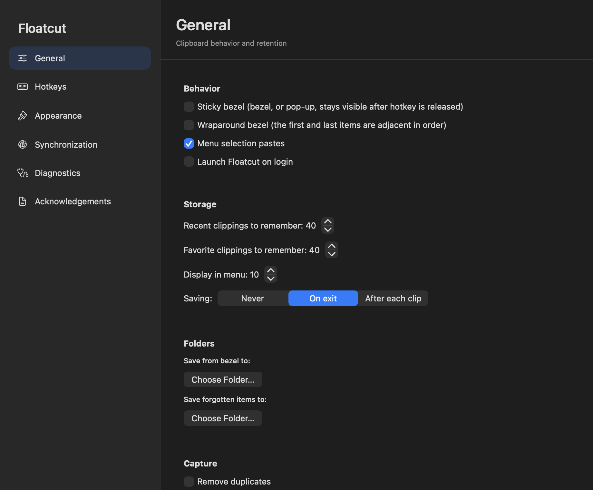
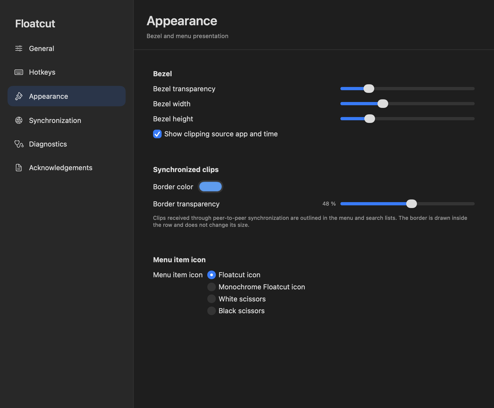
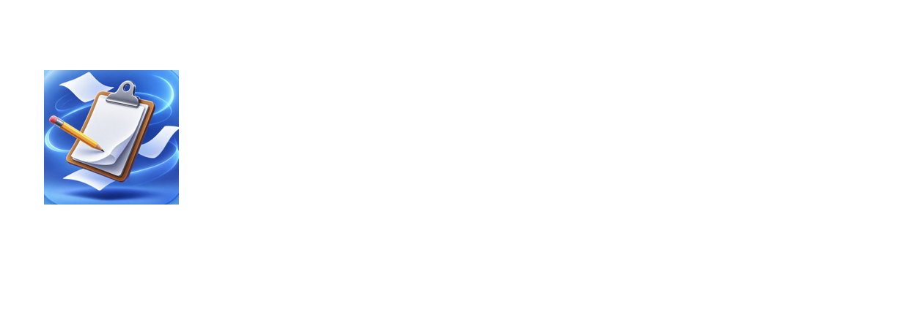

# Floatcut Bedienungsanleitung

[English](user-guide.md) | Deutsch · [Projektübersicht](readme.de.md)

Diese Anleitung beschreibt Floatcut 4.0 für macOS. Die Screenshots verwenden für eine einheitliche Darstellung die englische Benutzeroberfläche; die deutschen Bezeichnungen werden im Text genannt.

## Inhalt

- [Erster Start](#erster-start)
- [Zwischenablage-Menü](#zwischenablage-menü)
- [Favoriten](#favoriten)
- [Suche und Bezel](#suche-und-bezel)
- [Einstellungen](#einstellungen)
- [Peer-to-Peer-Synchronisation](#peer-to-peer-synchronisation)
- [Migration von Flycut](#migration-von-flycut)
- [Datenschutz und lokale Daten](#datenschutz-und-lokale-daten)
- [Fehlerbehebung](#fehlerbehebung)
- [Tastaturübersicht](#tastaturübersicht)

## Erster Start

Floatcut läuft in der Menüleiste und öffnet kein herkömmliches Hauptfenster. `Floatcut.app` nach `/Applications` kopieren, starten und rechts in der Menüleiste nach dem Floatcut-Icon suchen.

Die App ist lokal beziehungsweise ad hoc signiert und nicht notarisiert. Falls macOS sie blockiert, Floatcut einmal starten und anschließend unter **Systemeinstellungen → Datenschutz & Sicherheit → Trotzdem öffnen** freigeben. Die Quarantäne sollte nur für ein vertrauenswürdiges Bundle umgangen und Gatekeeper niemals global deaktiviert werden.

Floatcut fragt nach der Bedienungshilfen-Berechtigung, um in der aktiven Anwendung den Einfügebefehl auslösen zu können. Die Erfassung funktioniert auch ohne diese Berechtigung, das automatische Einfügen möglicherweise nicht. Für die Synchronisation ist zusätzlich der Zugriff auf das lokale Netzwerk erforderlich.

## Zwischenablage-Menü

Das Menü wird durch einen Klick auf das Menüleisten-Icon geöffnet.

<p align="center">
  
</p>

Die neuesten Clips stehen oben. Jede Textzeile zeigt eine Vorschau und – sofern unter **Darstellung** aktiviert – Quellanwendung und Zeitstempel. Bei Bildern erscheint ein Vorschaubild. Ein Klick auf den Inhalt wählt ihn aus und fügt ihn bei aktivierter Option **Menüauswahl fügt ein** in die aktive Anwendung ein.

Die Bedienelemente haben folgende Aufgaben:

- **Suchfeld:** filtert den gerade aktiven Speicher während der Eingabe.
- **Stern neben der Suche:** öffnet die Favoriten. Dort wird er zum Zwischenablage-Button, der zum normalen Verlauf zurückführt. Beim Umschalten wird nichts gelöscht.
- **Stern an einem Verlaufseintrag:** übernimmt den Clip zusätzlich in die Favoriten und wird hervorgehoben. Ein weiterer Klick entfernt nur die Favoritenkopie.
- **Löschsymbol an einem Favoriten:** entfernt den Clip aus den Favoriten, behält ihn aber im normalen Verlauf.
- **Alles löschen:** leert den normalen Verlauf und erhält die Favoriten.
- **Favoriten löschen:** erscheint im Favoritenspeicher und leert nur diesen.
- **Texte zusammenfassen:** erzeugt einen neuen Clip aus allen Texteinträgen des aktiven Speichers in zeitlicher Reihenfolge, getrennt durch Zeilenumbrüche. Bilder werden ignoriert und die ursprünglichen Einträge bleiben erhalten.

Ein dezenter farbiger Innenrahmen kennzeichnet Clips, die über die Peer-to-Peer-Synchronisation empfangen wurden. Farbe und Transparenz sind konfigurierbar; der Rahmen verändert die Zeilengröße nicht.

Mit Wahltaste-Klick auf das Menüleisten-Icon lässt sich die Erfassung pausieren oder fortsetzen, etwa bevor vertrauliche Daten kopiert werden.

## Favoriten

Favoriten liegen in einem getrennten, dauerhaft gespeicherten Bereich. Er wird über den Stern neben der Suche oder mit **F** im Bezel geöffnet.

Im normalen Verlauf kopiert der Zeilenstern einen Eintrag in die Favoriten, ohne ihn aus dem Verlauf zu entfernen. Ein hervorgehobener Stern zeigt an, dass der Eintrag bereits als Favorit vorhanden ist. Ein erneuter Klick entfernt die Favoritenkopie. In der Favoritenansicht erscheint stattdessen ein Löschsymbol; das Löschen dort lässt den entsprechenden Eintrag im normalen Verlauf bestehen beziehungsweise übernimmt ihn dorthin.

Die maximale Anzahl für Verlauf und Favoriten wird unter **Einstellungen → Allgemein** getrennt festgelegt.

## Suche und Bezel

### Suchfenster

Standardmäßig öffnet **Umschalt-Befehl-B** die Suche. Durch Tippen wird der Verlauf gefiltert, mit den Pfeiltasten wird navigiert und Return fügt den ausgewählten Treffer ein. Der Hotkey kann unter **Hotkeys** geändert werden.

### Bezel

Standardmäßig öffnet **Umschalt-Befehl-V** das Bezel: eine kompakte Einblendung zur tastaturgesteuerten Verlaufsauswahl. Mit den Pfeiltasten oder J/K navigieren und mit Return einfügen. Escape schließt die Ansicht, ohne etwas einzufügen.

Bei aktiviertem **Fixierten Bezel** bleibt die Einblendung nach dem Loslassen der Aktivierungstasten verfügbar. Leertaste oder Rechtsklick können sie ebenfalls fixieren. **Umlaufendes Bezel** verbindet das neueste und älteste Ende der Liste.

## Einstellungen

Die Einstellungen über das Floatcut-Menü oder im aktiven Bezel mit **Befehl-,** öffnen.

<p align="center">
  
</p>

### Allgemein

Unter **Verhalten** werden fixierte und umlaufende Bezel-Navigation, das direkte Einfügen bei einer Menüauswahl und der Start bei der Anmeldung gesteuert.

Unter **Speicher** lassen sich die Höchstzahl der letzten Clips und Favoriten, die Zahl der im Menü angezeigten Einträge sowie der Sicherungszeitpunkt einstellen: nie, beim Beenden oder nach jedem Clip. Zwei Ordnerauswahlen bestimmen die Ziele für manuell aus dem Bezel gespeicherte und automatisch gesicherte verdrängte Einträge.

Unter **Erfassung** stehen folgende Schutz- und Verhaltensoptionen bereit:

- **Duplikate entfernen:** verhindert wiederholte Kopien im Verlauf.
- **Eingefügten Eintrag nach oben verschieben:** behandelt einen erneut genutzten Clip als neuesten Eintrag.
- **Nicht aus Passwortfeldern kopieren:** filtert Zwischenablage-Typen von Passwortprogrammen und geschützten Feldern.
- **Vergessene Clips/Favoriten sichern:** schreibt durch die eingestellte Kapazität verdrängte Einträge in den gewählten Ordner.
- **Passwortähnliche Inhalte anhand Länge und Zeichentypen erkennen:** überspringt Werte, deren Länge in der kommagetrennten Liste steht und die Großbuchstaben, Kleinbuchstaben, Ziffern sowie Satz- oder Sonderzeichen, aber keine Leerzeichen enthalten. Dies ist nur eine Heuristik und keine Garantie.

### Hotkeys

Hier werden der globale Aktivierungs- und Such-Hotkey geändert, die Bedienungshilfen-Berechtigung geprüft und die anwendungsinternen Kürzel angezeigt. Die gewählten Kombinationen dürfen nicht mit macOS oder einem anderen Hilfsprogramm kollidieren.

### Darstellung

<p align="center">
  
</p>

Konfigurierbar sind Transparenz, Breite und Höhe des Bezels, die Anzeige von Quellanwendung und Zeitstempel, Farbe und Transparenz des Rahmens für synchronisierte Clips sowie verschiedene Menüleisten-Icons. Die Sprache der Oberfläche richtet sich nach den macOS-Spracheinstellungen.

### Diagnose

- **Zwischenablage-Typen im Verlauf erfassen** fügt den erkannten Text-Zwischenablagetyp als Diagnoseeintrag zum Verlauf hinzu. Dafür muss der Passwortfeld-Filter aktiv sein; im Normalbetrieb sollte die Option ausgeschaltet bleiben.
- **Detailliertes Sync-Logging** protokolliert bereinigte Informationen zu Erkennung, Kopplung, Verbindung, Übertragung und Widerrufen für die Fehlersuche.
- **Widerrufsliste leeren** entfernt lokal gespeicherte Widerrufseinträge. Eine Kopplung wird dadurch nicht wiederhergestellt; ein Gerät muss erneut gekoppelt werden, wenn es wieder vertrauenswürdig sein soll.

### Danksagung

Diese Seite nennt die Mitwirkenden von Jumpcut, Flycut und Floatcut sowie verwendete Drittkomponenten.

<p align="center">
  
</p>

## Peer-to-Peer-Synchronisation

Die Synchronisation ist optional und erfolgt direkt im lokalen Netzwerk. Es gibt keinen zentralen Server, keinen iCloud-Speicher, kein Konto, keine Offline-Warteschlange und keine nachträgliche Übertragung des Verlaufs. Nur neue unterstützte Clips werden Geräten angeboten, die im Kopierzeitpunkt gekoppelt und online sind. Ein empfangener Clip wird nicht erneut weitergeleitet; dadurch werden Schleifen vermieden.

### Aktivieren und koppeln

1. **Einstellungen → Synchronisation** öffnen und die lokale Synchronisation aktivieren.
2. Einen eindeutigen Gerätenamen wählen.
3. Die Synchronisation auf dem anderen Gerät aktivieren und dessen Erkennung abwarten.
4. Die Kopplung auf einem der Geräte starten.
5. Den sechsstelligen Code auf beiden Geräten vergleichen. Nur bestätigen, wenn beide Codes übereinstimmen.
6. Das Gerät erscheint in der Liste der gekoppelten Geräte. Der Status zeigt, ob es gerade erreichbar ist.

macOS kann nach der Berechtigung für das lokale Netzwerk fragen. Firewalls und Netzwerkfilter wie Little Snitch müssen Floatcuts lokalen Erkennungs- und Verbindungsverkehr zulassen.

### Bedienelemente gekoppelter Geräte

- Der Aktivierungsschalter steuert den Austausch mit diesem vorhandenen Gerät.
- Das Zahnrad öffnet die Einstellung für ausgehende Bilder dieses Geräts. Das Ausschalten von **Bilder an dieses Gerät senden** betrifft nur das Senden; der Bildempfang bleibt aktiv.
- **Entkoppeln** entfernt das Vertrauen und erzeugt einen Widerrufseintrag. Verlauf und Favoriten werden nicht gelöscht.
- **Neue Kopplungsanfragen zulassen** kann alle neuen Anfragen verwerfen, während vorhandene Kopplungen weiter funktionieren.

Textclips werden über Protokoll V2 synchronisiert. PNG- und JPEG-Bilder können ebenfalls gesendet werden, wenn die ausgehende Option für das Zielgerät aktiv ist. Der Bildempfang ist von diesem Sendeschalter unabhängig. Favoritenstatus, vollständiger Verlauf und Löschaktionen werden nicht synchronisiert.

### Identität zurücksetzen

Die Sync-Identität liegt im macOS-Schlüsselbund. Mit einer stabilen lokalen Signierungsidentität können aktualisierte lokale Builds weiterhin darauf zugreifen. Eine Ad-hoc-Signatur oder geänderte Designated Requirement kann den Zugriff auf die vorhandene Identität verhindern.

Meldet Floatcut, dass die lokale Sync-Identität nicht verfügbar ist, unter **Synchronisation** die **Identität zurücksetzen**. Nach erfolgreichem Zurücksetzen wird die Warnung ausgeblendet. Dabei werden alle Kopplungen entfernt und müssen neu aufgebaut werden; Verlauf und Favoriten bleiben erhalten.

## Migration von Flycut

Erkennt Floatcut unterstützte Daten einer älteren Flycut-/Floatcut-Installation, erscheint ein Migrationseintrag in der Seitenleiste der Einstellungen.

1. Die ältere Anwendung beenden; während der Migration dürfen nicht beide Apps laufen.
2. Die Migrationsseite öffnen und die Prüfung ausführen.
3. Die manuelle Migration starten.
4. Floatcut führt normalen Verlauf und Favoriten getrennt zusammen und übernimmt unterstützte Einstellungen und Hotkeys.
5. Nach der Prüfung startet Floatcut neu und bestätigt den Erfolg.

Die Quelldaten der Einstellungen bleiben unverändert. Floatcut entfernt weder die alte Anwendung noch deren Anmeldeobjekt automatisch; den angezeigten Hinweisen folgen und die alte App nach erfolgreicher Prüfung manuell entfernen.

## Datenschutz und lokale Daten

Verlauf, Favoriten, Einstellungen, Kopplungsmetadaten und Widerrufe gehören zum jeweiligen macOS-Benutzer. Floatcut 4.0 verwendet keine iCloud-Synchronisation. Der private Sync-Schlüssel und das Zertifikat liegen im Schlüsselbund dieses Benutzers; Metadaten zu gekoppelten Geräten werden in dessen Application-Support-Bereich gespeichert.

Jeder Zwischenablage-Manager kann äußerst vertrauliche Inhalte sehen. Passwortfeld-Filter, Erkennung passwortähnlicher Werte und Aufzeichnungspause sollten entsprechend eingesetzt werden. Nur eigene Geräte koppeln und Kopplungscodes sorgfältig vergleichen. Detaillierte Sync-Protokolle werden bereinigt, sollten vor einer Weitergabe aber dennoch geprüft werden.

## Fehlerbehebung

### Floatcut wird beim ersten Start blockiert

Unter **Systemeinstellungen → Datenschutz & Sicherheit → Trotzdem öffnen** freigeben. Bei einem vertrauenswürdigen Bundle kann alternativ gezielt dessen Quarantäne-Attribut entfernt werden:

```bash
xattr -dr com.apple.quarantine "/Applications/Floatcut.app"
```

[Sentinel](https://github.com/alienator88/Sentinel) kann bei vertrauenswürdigen Apps helfen, befindet sich jedoch im Wartungsmodus. Gatekeeper nicht global deaktivieren.

### Ein ausgewählter Clip wird nicht eingefügt

Unter **Einstellungen → Hotkeys** die Bedienungshilfen-Berechtigung prüfen und Floatcut unter **Systemeinstellungen → Datenschutz & Sicherheit → Bedienungshilfen** freigeben. Nach dem Ersetzen eines lokal gebauten App-Bundles kann macOS die Berechtigung erneut verlangen. Entwickelnde können einen veralteten Eintrag zurücksetzen:

```bash
tccutil reset Accessibility de.meierkarsten.floatcut
```

### Ein gekoppeltes Gerät wird als offline angezeigt

Prüfen, ob beide Apps laufen, die Synchronisation auf beiden Seiten aktiv ist, beide Geräte ein gegenseitig erreichbares lokales Netzwerk verwenden und Firewall- oder Netzwerkfilter-Abfragen bestätigt wurden. Floatcut stellt Clips nicht für eine spätere Zustellung an; nach dem Wechsel zu „Online“ den Inhalt erneut kopieren.

### Lokale Sync-Identität ist nicht verfügbar

Zunächst einen Build mit derselben stabilen lokalen Signierungsidentität verwenden. Andernfalls **Identität zurücksetzen** wählen und die Geräte neu koppeln. Verlauf und Favoriten bleiben erhalten.

### Eine Kopplung bleibt ausstehend

Die macOS-Abfragen für lokales Netzwerk und Firewall auf beiden Geräten bestätigen, Kopplung erneut starten und prüfen, ob neue Kopplungsanfragen zugelassen sind. Auf beiden Seiten denselben sechsstelligen Code vergleichen und bestätigen. Bei anhaltenden Problemen unter **Diagnose** das detaillierte Sync-Logging aktivieren.

## Tastaturübersicht

### Global und Menüleiste

| Kürzel | Aktion |
| --- | --- |
| Umschalt-Befehl-V | Zwischenablage-Bezel öffnen |
| Umschalt-Befehl-B | Zwischenablagesuche öffnen |
| Wahltaste-Klick auf Menü-Icon | Aufzeichnung pausieren oder fortsetzen |

### Bezel-Navigation

| Taste | Aktion |
| --- | --- |
| Pfeil hoch, Pfeil links oder K | Zu einem neueren Eintrag |
| Pfeil runter, Pfeil rechts oder J | Zu einem älteren Eintrag |
| Pos1 | Zum neuesten Eintrag |
| Ende | Zum ältesten Eintrag |
| Bild hoch / Bild runter | Zehn Einträge weiterspringen |
| 1–9, 0 | Zur Position springen; 0 steht für Position 10 |
| Scrollrad | Im Verlauf navigieren |

### Bezel-Aktionen

| Taste | Aktion |
| --- | --- |
| Return | Ausgewählten Eintrag einfügen und schließen |
| Fn-Return | Eintrag nach oben verschieben und schließen |
| Entf / Rückschritt | Eintrag löschen und schließen |
| Escape | Ohne Einfügen schließen |
| Doppelklick | Eintrag unter dem Mauszeiger einfügen |
| Befehl-, | Einstellungen öffnen |
| S | Eintrag im konfigurierten Ordner speichern |
| Umschalt-S | Eintrag speichern und entfernen |
| F | Zwischen Verlauf und Favoriten umschalten |
| Umschalt-F | Eintrag in die Favoriten verschieben |
| Leertaste oder Rechtsklick | Bezel fixieren |
